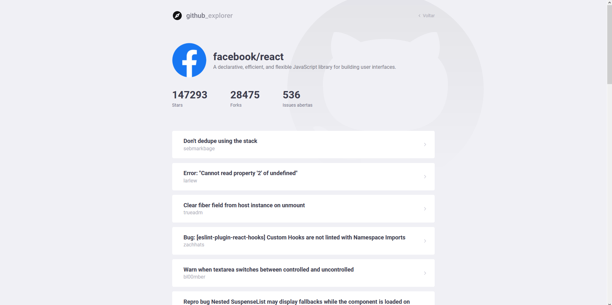

<h1 align="center">
    
</h1>

# Github Explorer

Its an application to manage a list of repositories from GitHub. Also you can check some details from author, like number of stars, forks, opened issues and his repositories

**&copy;  [Rocketseat](https://rocketseat.com.br/)**


<h3> It was developed in TypeScript using technologies:  React e  NodeJS


## Instalação

Primeiramente é necessário realizar o clone do projeto. Feito isso, será necessário utilizar alguma ferramenta para gerenciamento de pacotes (yarn ou npm).

Execute o comando ```yarn``` ou ```npm install``` nas pastas de backend, frontend e mobile para instalar as dependências do projeto.

Por fim, utilize o comendo ```npm start``` ou ```yarn start``` nas pastas de backend, frontend e mobile para inicializar as partes da aplicação.


## Telas

<p align="center">
    
    
</p>
