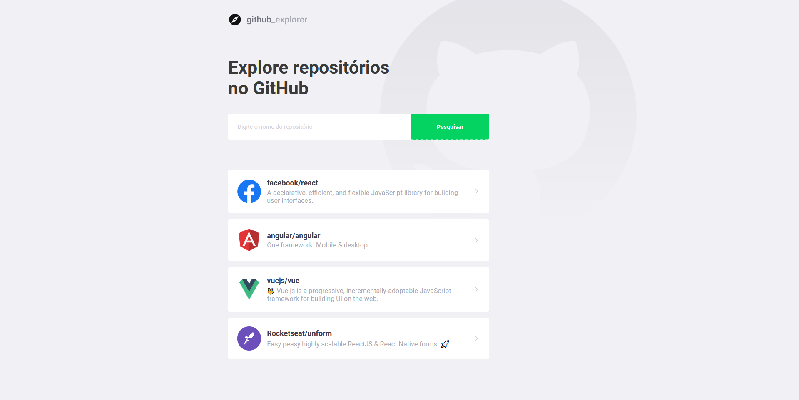

<h1 align="center">
    
</h1>

# Github Explorer

Its an application to manage a list of repositories from GitHub. Also you can check some details from author, like number of stars, forks, opened issues and his repositories

**&copy;  [Rocketseat](https://rocketseat.com.br/)**


<h3> It was developed in TypeScript using technologies:  React e  NodeJS


## Installation

First you need to clone the project, then it will be necessary a yarn or node to manage dependencies/packages

After you have attended the requirements, execute the following to download and install dependencies
```yarn```
or
```npm install```

Later, you will have to start the local server to launch GitHub Explorer
```npm start```
or
```yarn start```


## Application Image

<p align="center">
    
    
</p>
